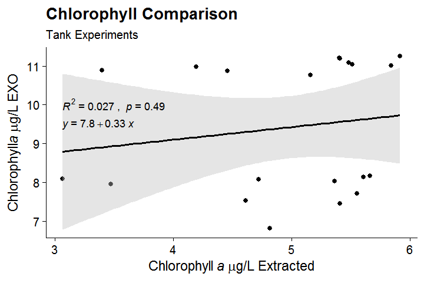
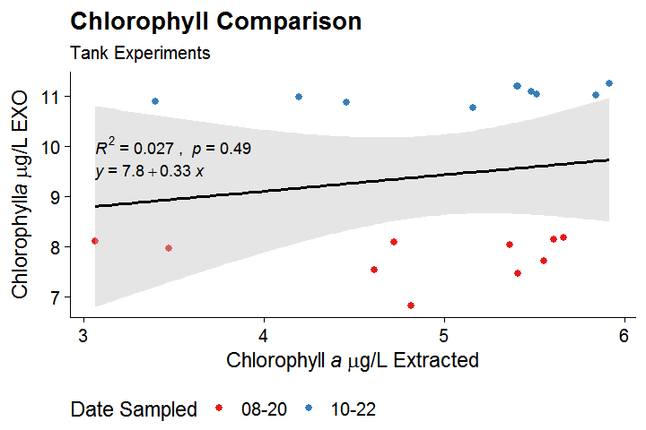
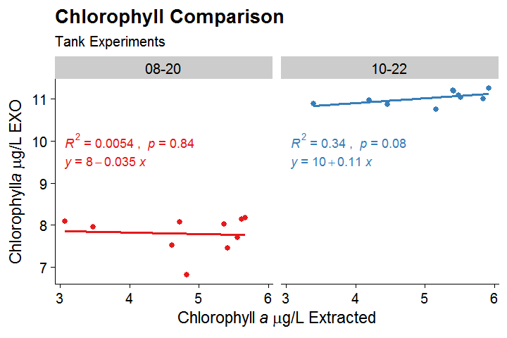
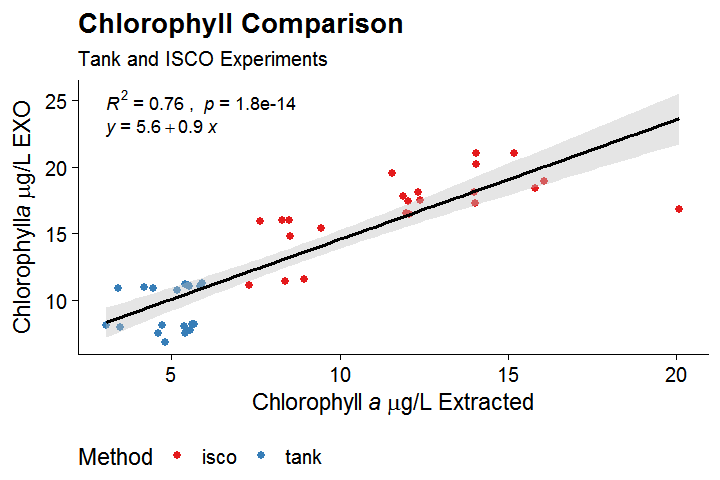
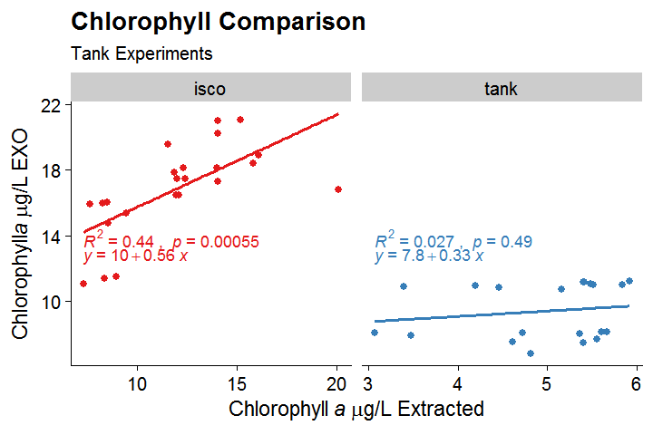

# CHLA-NERRS
Files for the Total Algae Chlorophyll Sensor Assessment project for the National Estuarine Research Reserve System

## R Code

Elaboration on the functions of each script

### `00_load_packages.R`

*  `tidyverse` - because, *tidyverse*
*  `lubridate` - works with dates and times
*  `here` - sets relative file paths
*  `janitor` - cleans data, specifically `clean_names()` function
*  `broom` - converts the linear model statistics into a tibble
*  `readr` - reads in the csv files
*  `ggpubr` - this expands the `ggplot2` package and gives more flexibility

### `01_read_std.R`

Brings in the .csv file that has the standard information (for calibration of the fluorometer prior to each extraction). The information in this file is then used to create a linear regression between the standard and 90% acetone solutions to produce the best fit line. The slope of this line is then used as the normalization coefficient for all the relative fluorescence units for each sample for a particular date. 
This also brings in the `_chla_raw.csv files` for specified date in `rundate` and uses the slope of the standard information regression to produce a chlorophyll value in ug/L for each relative fluorescence unit.

*Outputs:* 

*   `_chla.csv` file with all the calculated chlorophyll information
*   `plot_std_..._chla.png` that has the calculated slope based on the standards used.
*   `plot_std_eq_..._ chla.png` has the R2, p, and equation for standard lines

### `02_exo_chla.R`

This code reads in each of the extracted chlorophyll files in the 'output/chla_ext' folder and binds them into one dataframe. It also uses the `data_dictionary.csv` file to add in additional information associated with each extracted chlorophyll dataset (isco vs. tank). Then, it reads in and binds together the water quality data from the EXO. This is then joined with the extracted chlorophyll data into one data frame with all the information associated with the specific datetime stamps. No outputs except for the `chla_exo` data frame.

### `03_exo_chla_corr_plots.R`

This code creates plots! Lots of plots which are exported into the `/output` folder. There are currently nine sections of code:

**1.  run script to create dataframe -** 
this sources the `02_exo_chla.R` code to produce the `chla_exo` dataframe.

**2.  create axis titles for figures -** 
I want the micrograms per liter written out with the correct symbols.

**3.  plot chla ext vs exo for single date using LOOP -**
this plots the extracted vs exo total algae sensor chlorophyll data for a single date using a for LOOP function. It produces several plots associated with each date of a tank experiment. *NOTE: this does not produce a plot for the ISCO-related data.*

**4.  put tank studies onto one figure with R2, p-value, and linear equation -** 
this combines the values from all the tank studies into one extracted vs. exo total algae sensor chlorophyll data plot with R2, p-value, confidence interval, and linear equation

**5.  same figure as number 04, but with colors applied to the date points -** 
applies color to denote separate runs of the tank experiment (by date) but still produces a similar plot to the fourth step.

**6.  facet by date in tank studies with unique equations/lines each -** 
similar to the previous, except that the dates are also faceted into their own subplot with the associated R2, p-value, and linear equations included.

**7.  isco only figure comparison -**
this step will likely take on something similar to step number 3, however at the moment, 2019-11-11, there is only one isco comparison with data and thus this plot is only showing that day. Plot includes R2, p-value, confidence interval, and linear equation.

**8.  isco and tank comparison -**
combines all data (tank and isco) into one plot with R2, p-value, confidence interval, and linear equation with colors denoting the method.

**9.  isco and tank side-by-side comparison -**
data is faceted by method subplot

